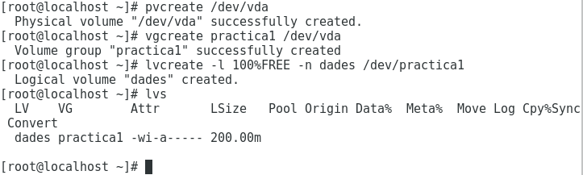
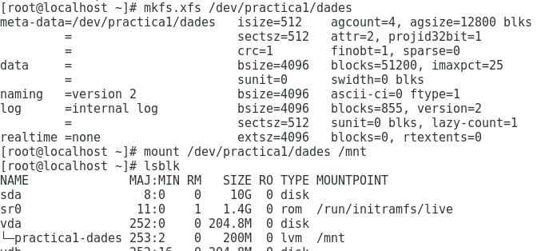
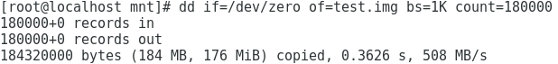
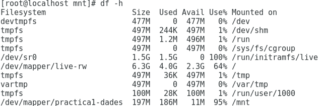
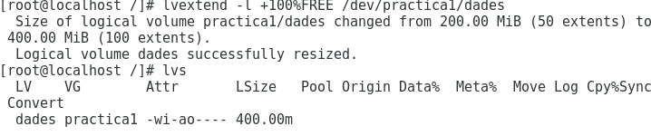
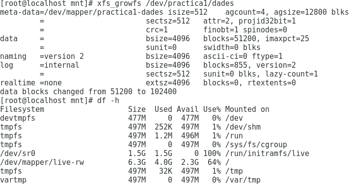
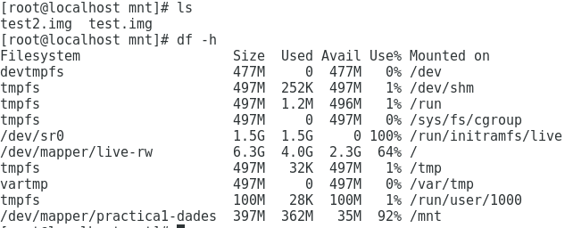

# Gestió de volums Lògics  
## Descripció del que són  
Els volums lògics són com uns discs durs virtuals a partir del disc dur físic. Aquests es poden particionar, juntar...  
## Què volen dir les següents sigles  
* PV: Physical Volume ~ Identificació dels discs físics. 
---
* ***pvcreate /dev/vda  (crea un PV del disc vda)***  
* ***pvs (llista els pv)***
---
* VG: Volume Group ~ Discs virtuals. Conjunt de PV que formen el VG. El seu tamany varia el tamany dels PV.
---
* ***vgcreate multimedia /dev/vda (crea el disc multimedia a partir del pv anterior)***  
* ***vgs (mostra els VG existents)***
---
* LV: Logical Volume ~ Particions. Particions creades a partir del VG anterior. El seu tamany es pot modificar sempre i quan no superi el del VG. El següent còdig mostra com fer-ho, indicant el volum que li donem i el nom.
---
* ***lvcreate -L +50M -n videos /dev/multimedia***  
* ***lvs (mostra els VL existents)***
---
## Entorn de pràctiques: Explicar com farem la pràctica detalladament (màquina virtual i afegir tres discs de 200M)  
> Per a aquesta pràctica farem servir una virtualització de Fedora 24 amb 3 discs VirtiO de 200 M cadascún, en un equip host Fedora 24.  
## Pràctica 1: Creació d'un volum lògic a partir d'un dels tres discs durs (vda per exemple). Aquest volum lògic ha de ser del total de capacitat del disc. El volum de grup s'ha de dir practica1 i el volum lògic dades.  
Per a crear un volum lògic del total, primer identificarem un dels discs (PV), farem un grup amb aquest PV i crearem un LV amb el total de l'espai existent.
1. Seleccionem el disc dessitjat, en aquest cas /dev/vda :  
---
`pvcreate /dev/vda`
---
2. Creem el VG anomenat "practica1" :  
---
`vgcreate practica1 /dev/vda`
---
3. Creem el volum lògic anomenat "dades" :  
---
`lvcreate -l 100%FREE -n dades /dev/practica1`
---  
4. Imatge de les comandes utilitzades:  
---  

---

## Pràctica 2: Creació d'un sistema de fitxers xfs al volum lògic creat i muntatge a /mnt. També s'ha de crear un fitxer amb dd de 180MB.  
1. Li assignarem un sistema de fitxers xfs al VL creat en la pràctica anterior amb la següent comanda:  
---
`mkfs.xfs /dev/practica1/dades`
---  
2. La montem a /mnt amb la comanda "mount":  
---
`mount /dev/practica1/dades /mnt`

---  
3. Creem el fitxer de 180 MB dintre del directori on ho volguem crear, en aquest cas /mnt:  
---
`dd if=/dev/zero of=test.img bs=1K count=180000`

---  
4. Comprovem que s'ha creat amb df -h :  
---

---  

## Pràctica 3: Creació d'un RAID 1 als dos discos sobrants (vdb i vdc per exemple)
1. Creem el raid 1 amb la següent comanda fent servirs els altres dos discs que teniem:  
--- 
`mdadm --create /dev/md0 --level=1 --raid-devices=2 /dev/vdb /dev/vdc`
---  

## Pràctica 4: Ampliació del volum lògic de dades al raid  
1. Primer identifiquem el raid per a poguer-lo afegir al volum del grup:  
---
`pvcreate /dev/md0`
---  
2. L'afegim al volum del grup existent, és a dir, a practica1:  
---
`vgextend practica1 /dev/md0`
---  
3. Un cop fet això, ampliem el tamany del volum lògic dades:  
---
`lvextend -l +100%FREE /dev/practica1/dades`
--- 
4. Comprovem que s'ha fet correctament:  
---

---

## Pràctica 5: Ampliació del sistema de fitxers xfs al tamany actual del volum lògic dades (s'ha de poder fer sense desmuntar-lo de /mnt ja que és xfs). Una vegada creat crearem un nou fitxer de 180M.  
1. Augmentem el tamany del sistema de fitxers xfs al volum actual del LV:  
---
`xfs_growfs /dev/practica1/dades`

---  
2. Creem un altre arxiu anomenat "test2" de 180 MB com abans:  
---
`dd if=/dev/zero of=test2.img bs=1K count=180000`
---
3. Comprovem que s'ha creat correctament i augmenta el tamany ocupat:  
---

---  
